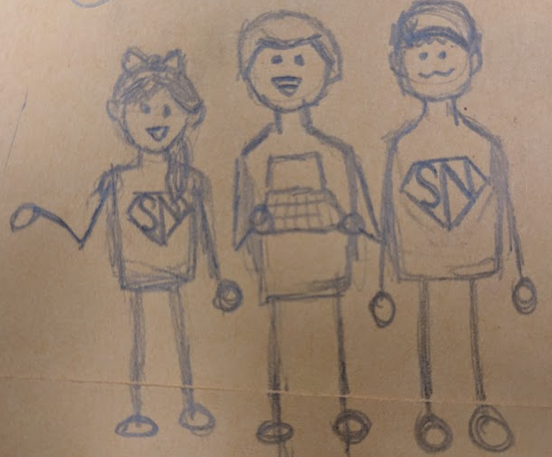

# Impact Judges' Questions

### Media
- Who is interacting with teams that reach out to?
    - Is there a team of people in charge of responding to our social media?
- Is there anything actionable out of our social media?
    - _Hopefully we will have covered this in our presentation from now on 🙃_
- Why do we think we have so many followers? What was the _magic_ that caused to have so many views?
    - What moment/video made us go viral?
- What are our stats on our viewers watching outside of the US? (What percent, the amount of countries, etc.)
- Elaborate on the Lectec collaboration. A judge recognized them from a Sharktank episode and found it cool we were working with them. How did we get involved with them?

### Outreach
- How are we mentoring teams long distance vs. teams locally?
    - How do we handle global mentorship?
- Elaborate on the partnership with CSHS.
    - What was the time period of us reaching 5,000 middle school students?
- Is our outreach mostly robot and coding related? Do we teach other STEM stuff like math and physics?
    - _No 😔, but don't be afraid to say no_ 

### Team
- What are we most proud of about our team?
- So we have 25 members. Are all members of our team equally active?
    - How many of us focus on robot stuff versus media stuff?
- What is the split between grade levels?
    - _We answered mostly freshmen and seniors. They asked:_ Why do we think that is?

