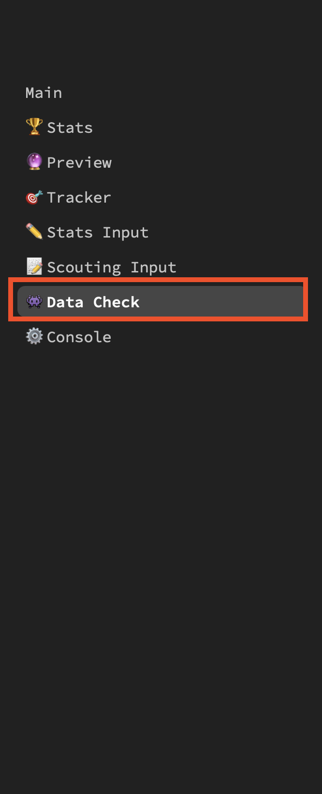
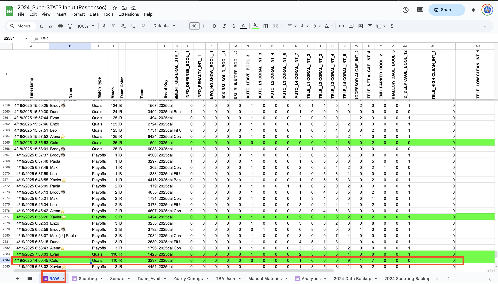
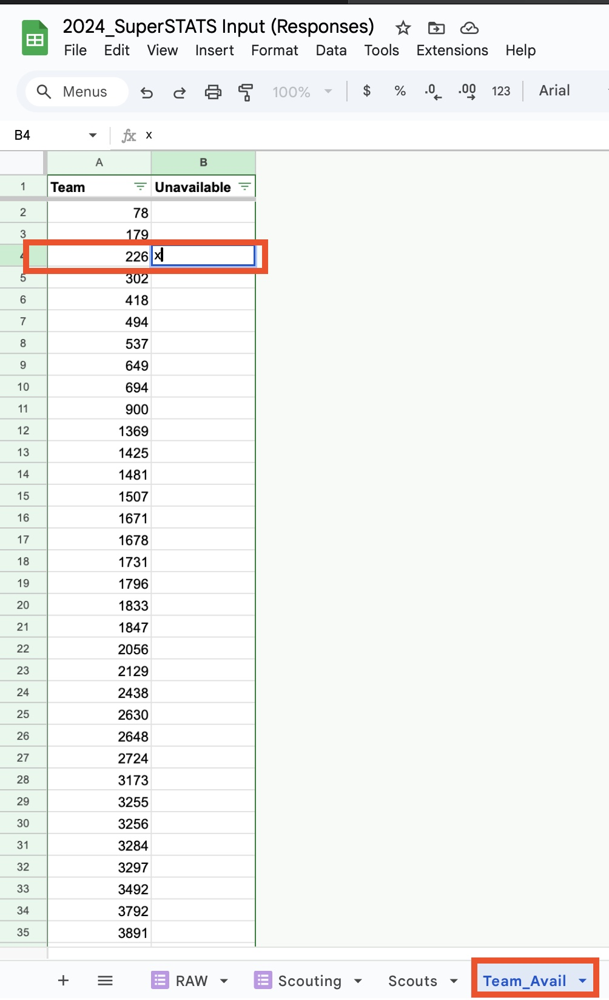

# Reference for Running Stats at Competition

### General Stats things
- Stats mentor/stats lead should have write access to the [stats input Google sheet](https://docs.google.com/spreadsheets/d/1KboyFTIZJiIW_33Z9_ea8jtYkV3T-fuS659ezwsXYmY/edit?gid=1878511843#gid=1878511843). If not, request access
- Members of stats team will use `comp-stats-chat` channel in Slack to communicate
- If a scout has to miss taking stats for their match, they must inform the stats mentor/chat and ask for a substitute
- If a scout only has partial data for a match, tell them not to submit it
- If is scout tried to submit their complete data, but they are not sure if it went through, have them submit again
- Pit scouting should be done on practice day and be finished before lunch
  - Pit scouting should be done in small groups to divide and conquer

### Practice Matches
- Enable practice mode
- Manually assign stats schedule via [this sheet](../.downloads/rulesets/stats_practice_match_assignments.pdf){:download}

### Qualification Matches
- Turn off practice mode and have students refresh the stats app
- Scouts will be automatically assigned match numbers and robot to track for all Quals matches

### Stats Cleanup
- Stats mentor/stats lead should confirm that 6 entries are submitted each match by checking the [RAW tab](https://docs.google.com/spreadsheets/d/1KboyFTIZJiIW_33Z9_ea8jtYkV3T-fuS659ezwsXYmY/edit?gid=1878511843#gid=1878511843) of the stats entry sheet
- Delete duplicate entries
- Make sure that all entries have the correct match number
  - If any entries have the incorrect match number, fix the match number and team number in the spreadsheet
  - You can find the correct team number for the match by navigating to the correct match number master list view
- If a match is missing 1 entry from one or both alliances, the data check page of the stats app will calculate the missing data
  - Navigate to the [data check](https://superstats.streamlit.app/Data_Check) page and expand the section for the missing match
  
  - Toggle the raw JSON view and you should see all the raw data entries with the scouts names
  - There should also be rows that have "Calc" instead of a student's name. Copy this entire row and paste it at the bottom of the [RAW tab](https://docs.google.com/spreadsheets/d/1KboyFTIZJiIW_33Z9_ea8jtYkV3T-fuS659ezwsXYmY/edit?gid=1878511843#gid=1878511843)
  

### Alliance Selection
- Stats mentor/lead should be sitting with one or both SN coaches for Alliance selection
- Stats mentor/lead will listen for team numbers to be announced and mark an "x" next to them respectively in the [`Team_Avail`](https://docs.google.com/spreadsheets/d/1KboyFTIZJiIW_33Z9_ea8jtYkV3T-fuS659ezwsXYmY/edit?gid=337514688#gid=337514688) tab in the spreadsheet
  - IMPORTANT: An "x" must be added REGARDLESS of whether the team accepts or declines an invitation
  