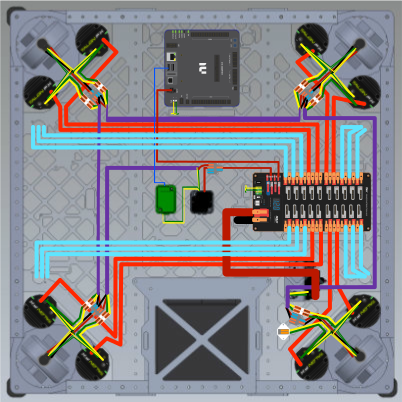

# Drivetrain Wiring 101

## Battery Cage Orientation

Label the bottom of the battery cage with **North**, **East**, **South**, and **West** compass directions. This allows for consistent and easier labeling of wires in the future (e.g., NWD = North West Drive motor).

## Mounting Electronics

See [Component Mounting](Component%20Mounting.md) and [Bolt to Tool Lookup](../Mechanical/Bolt%20to%20Tool%20Lookup.md) for tools to use.

| Device       | Bolt Size  | Bolt Length | Notes                                                                       |
| ------------ | ---------- | ----------- | --------------------------------------------------------------------------- |
| PDH          | 10-32 Bolt | 3/4"        |                                                                             |
| RoboRIO 2.0  | 4-40 Bolt  | 1/4"        | RIO has a 3D printed cover that keeps all wires in place                    |
| CANivore     | 4-40 Bolt  | 3/4"        | CANivore has a 3D printed cover that keeps the wire from unplugging. **THIS IS REQUIRED!!** |
| Pigeon 2.0   | 4-40 Bolt  | 3/4"        |                                                                             |

## Planning Wire Routes (String Method)

Once electronics are mounted, use 3 different strings to plan wire routes **before** running any real wires. Route the string in this order:

| String                  | Represents                        |
| ----------------------- | --------------------------------- |
| 🔴 Red thick string     | 10 or 12 AWG power wires          |
| 🟠 Orange thin string   | 18 AWG power wires                |
| ⬜ White thin string    | CAN wire                          |

!!! important

    Once all strings are laid, **get approval from a mentor** before proceeding to run real wires.

## Wire Routing

After mentor approval, run the real wires following the same order as the strings above (thickest wires first, then thinnest):

1. 10 AWG power wires
2. 18 AWG power wires
3. CAN wires

## Wire Labeling

As you wire, label every wire with zip tie labels.

!!! important

    Color of zip tie labels is important. Be sure to follow the **year-specific color coded wire guide**. The label color may change year to year — always check before starting!

!!! note

    Use the label maker with **clear background labels** so the zip tie label color is still visible.

### FROM/TO Labeling Convention

Labels indicate which device the wire goes **FROM** and which device it goes **TO**.

- **Both ends** of every wire must be labeled.
- Format: `FROM DEVICE` on top, `TO DEVICE` on bottom (separated by a dividing line).

**Example:** A wire going from the PDH to the North West Drive motor:

- PDH end label: `PDH/NWD`
- NWD end label: `NWD/PDH`

## PDH Breakers

- **Top slots (10 or 12 AWG):** Use orange REV 40-amp breakers (🟠).
- **Smaller fuse slots (18 AWG):** Use small red 10-amp breakers (🔴).

## Main Power Wires

Main power wires connect the battery to the robot's power system using 4 AWG red (positive) and black (negative) wire.

### Making the Battery-Side End

1. Source 4 AWG red and black wire. Choose either positive (red) or negative (black) to start.
2. Strip the wire to the **silver sharpie line** on the wire stripper.
3. Place a **swaged SB50 Battery contact** on the stripped end and crimp.

#### Swaging the SB50 Battery Contact

1. Take the swage guide and place it in with the **curve facing down**. Make sure it is as straight as possible.
2. Once secured in the guide, take it to the **arbor press**.
3. Press starting from **small tool to big**, then end by pressing with the **concave end**.

#### Crimping the Swaged Contact

- Use the **hydraulic crimper** with the **2 AWG crimp attachments** (even though the wire is 4 AWG).
- After crimping, fins will stick out the sides — **turn the crimp 90° and crimp again** to flatten the fins.
- Once all sides are flat, insert the contact into the **red SB50 AndyMark Battery Housing**.
  - Make sure the curved hook side of the swage hooks over the metal prongs inside the Battery Housing.

4. Repeat for the other colored wire (red or black) and **get approval from a mentor**.

### Cutting and Completing the PDH-Side End

5. Once approved, have a mentor consult on the correct wire length to cut. (This can change year to year.)
6. Cut the wire to the desired length.
7. Slide a piece of **clear heat shrink** onto the end that does not already have the Battery Housing.
8. Strip this end **twice** to the gray line on the wire stripper.
9. Slide the heat shrink back to cover half of the exposed wire and heat shrink it.
10. The wire is now ready to connect to the PDH.

!!! note

    For the red power wire, you will need to follow the [Main Breaker Wiring](#main-breaker-wiring) section below, since you essentially have two red wires.

## Main Breaker Wiring

The main power breaker has two ports for wire connection. **Only positive (red) 4 AWG wire** should be connected to both terminals. The breaker acts as an interruptor of the positive circuit:

- **Closed (flipped shut):** power flows and the robot is on.
- **Red button pressed / switch flipped open:** circuit is interrupted and the robot shuts off.

### Steps

1. Strip the end of 4 AWG red wire once to the **gray line** on the wire stripper.
2. Slide a **4 AWG Breaker 1/4" Ring Terminal** onto the stripped end.
3. Use the **hydraulic crimper** with the **4 AWG attachments**.
4. Repeat this crimp for **two** 4 AWG red wire ends:
   - One on the **opposite end of the red SB50 Battery Housing** wire.
   - One on a **separate piece of 4 AWG red wire** that will go from the Main Breaker to the PDH.
5. The wire with the SB50 Housing is now ready to connect to the Main Breaker. Don't forget the **NordLock Washers** that sit on top of the ring terminals when tightening!
6. For the MB-PDH wire: once you know the wire length, cut it to length and complete the PDH-side end following steps 7–9 from [Main Power Wires](#main-power-wires) above.

!!! important

    Once all wires are laid and connected, **ask a mentor for final approval** before powering on the robot.

## Swerve Diagram

