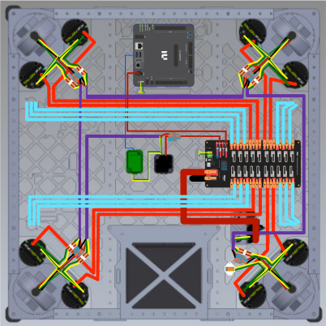

# Drivetrain Wiring

## Swerve Diagram

### Color Code

- 🔴 Thick Red: 10 AWG Power Wire for **Drivetrain Motors**
- 🟢 Thin Green: CAN Wire for **Drivetrain Motors and CANCoders**
- 🔴 Thin Red: 18 AWG Power Wire for **Drivetrain CANCoders**
- 🔵 Thick Cyan: 10 AWG Power Wire for non-drivetrain motors

## Steps

1. Mount all components. [See Component Mounting](Component%20Mounting.md)

### 10 AWG Power Wire

1. Run Orange/Red string to map out 10 AWG wire lengths. [See Swerve Diagram](#swerve-diagram)
   1. Cut string to length
   2. tape down (same way we will do zip ties later - in X parts of light weighting holes)
2. Create Orange/Red Labels for each wire on both sides of a connector (`FROM DEVICE` and `TO DEVICE` marked with a dividing line. `FROM` is on top `TO` on bottom.)
3. Pull off Orange/Red string and cut 10 AWG wire to length (bias to being too long).
   1. Strip 10mm of insulation off each end (marked on cutters).
4. Connect wires to devices and connectors
5. Use zip ties to secure wires to frame (same holes as string tape) and to each other (bundle wires together). Use zip tie mounts if needed. Make sure to leave some slack for movement and maintenance.

### CAN Wire/18 AWG Power Wire

1. Run White/Green string to map out CAN wire lengths. [See Swerve Diagram](#swerve-diagram)
   1. Cut string to length
   2. tape down (same way we will do zip ties later - in X parts of light weighting holes)
2. Create White/Green Labels for each wire on both sides of a connector (`FROM DEVICE` and `TO DEVICE` marked with a dividing line. `FROM` is on top `TO` on bottom.)
3. Pull off White/Green string and cut **CAN wire** to length (bias to being too long).
   1. Strip 10mm of insulation off each end (marked on cutters).
   2. Add **22 AWG (white)** Ferrules to ends of the CAN wires (CAN H and CAN L) to make it easier to connect to devices and connectors.
4. Pull off White/Green string and cut **18 AWG Power wire** to length (bias to being too long).
   1. Strip 10mm of insulation off each end (marked on cutters).
   2. Add **18 AWG (red)** Ferrules to ends of power wires to make it easier to connect to devices and connectors.
5. Connect wires to devices and connectors
6. Use zip ties to secure wires to frame (same holes as string tape) and to each other (bundle wires together). Use zip tie mounts if needed. Make sure to leave some slack for movement and maintenance.
