# State Machines

---

## What is a State Machine?

### Definitions

* **Technical Definition:** An abstract model to outline sequential logic.
* **Conceptual Definition:** Think of it as a "map of choices" that are dependent on previous choices.

### Core Concepts

* **State:** Essentially represents a condition or a set of conditions.
* **Transition:** If the condition or state changes, it results in a transition to the next state.

---

## Examples of State Machines

### 1. Simple Example: Traffic Lights

In this example, the colors are the states.

**The Logic Flow:**

* After **60** seconds: **🟢 Green** transitions to **🟡 Yellow**.
* After an additional **60** seconds: **🟡 Yellow** goes to **🔴 Red**.
* After **60** more seconds: **🔴 Red** goes to **🟢 Green**.

**Constraints:**

* **🟢 Green** cannot directly transition to **🔴 Red**.
* **🔴 Red** cannot directly transition to **🟡 Yellow**.

### 2. Complex Example: Super Mario

In this example, Mario's forms are the **states** and the items are the **conditions** for **transitioning**.

```mermaid
stateDiagram-v2
 direction LR
 
 %% States
 state "🔴 Mario" as M
 state "🔴➡️🔵 Super Mario" as SM
 state "🔴➡️🔥 Fire Mario" as FM
 state "🔴➡️🪶 Cape Mario" as CM

 %% Transitions based on Items (Conditions)
 M --> SM : 🍄 Mushroom
 SM --> FM : 🔥 Fire Flower
 SM --> CM : 🪶 Feather
 
 %% Cross Transitions
 FM --> CM : 🪶 Feather
 CM --> FM : 🔥 Fire Flower
 
 %% Styling
 style M fill:#FF6B6B,color:#fff
 style SM fill:#4A90E2,color:#fff
 style FM fill:#FFB347,color:#000
 style CM fill:#90EE90,color:#000
```

**The Logic Flow:**

* One state can transition to several other states depending on the **conditions**.
* Normal Mario has three different states he can transition to depending on the item he collects.
* The other states can transition to one another depending on the item.
* The diagram maps all the transitions Mario can make.

---

## Why Use a State Machine?

* **Reliable:** It is reliable and intelligent.
* **Automated Thinking:** The code does the thinking for you.
* **Abstraction:** Allows you to approach programming from a high-level/abstract perspective.
* **Structure:** Think of code as step-by-step logic.

---

## Case Study: 2024 Offbot State Machine

This diagram shows a real-world application used by Team 3255.

**Key Mechanics:**

* **Target States:** Can be set at any time (via buttons), but the robot remains in the actual state until that state's preconditions are met.
* **Flow Example:**
  * **Intaking:** Transitions to "Store Transfer" when sensor feedback confirms it is finished.
  * **Store Transfer:** Can branch into various "Prep" states (Speaker, Shuffle, Amp) based on inputs.
  * **Shooting:** Triggered when the "Same Shoot BTN" is pressed.
  * **Climb:** Triggered by the driver hitting "up on Climbers".

---

## Implementation Guide

### How to Implement a State Machine

!!! important

    States are the goal that the robot is trying to achieve

1. **List States:** Before programming, list the states.
2. **Identify Motors:** Identify all motors/counts
3. **Categorize Motors:** Decide what type of motor it is. Does it go in **Motion** or **Rotors**?
4. **Connect the motors:** Identify which motors are involved in each state.
5. **Create Issues for Clustered Motors/States:** Split the motors/states by **Rotors** and **Motion** to avoid merge conflicts.
6. **Assign and Implement Issues to Create Protobot Skeleton**
7. **Assign Buttons:** Assign buttons to trigger state transitions.
8. **Identify Conditions:** Identify transition conditions, including inputs.
9. **Create Diagram:** Create a diagram of the states and transitions to show how the completion of one command leads to the next.
