# State Machine Lesson

---

## What is a State Machine?

### Definitions

* **Technical Definition:** An abstract model to outline sequential logic.
* **Conceptual Definition:** Think of it as a "map of choices" that are dependent on previous choices.

### Core Concepts

* **State:** Essentially represents a condition or a set of conditions.
* **Transition:** If the condition or state changes, it results in a transition to the next state.

---

## Examples of State Machines

### 1. Simple Example: Traffic Lights

In this example, the colors are the states.


**The Logic Flow:**

* After **60** seconds: <span style="color: #90EE90; background-color: #000000; padding: 2px 4px; border-radius: 3px;">**🟢 Green**</span> transitions to <span style="color: #FFFF00; background-color: #000000; padding: 2px 4px; border-radius: 3px;">**🟡 Yellow**</span>.
* After an additional **60** seconds: <span style="color: #FFFF00; background-color: #000000; padding: 2px 4px; border-radius: 3px;">**🟡 Yellow**</span> goes to <span style="color: #FF6B6B; background-color: #000000; padding: 2px 4px; border-radius: 3px;">**🔴 Red**</span>.
* After **60** more seconds: <span style="color: #FF6B6B; background-color: #000000; padding: 2px 4px; border-radius: 3px;">**🔴 Red**</span> goes to <span style="color: #90EE90; background-color: #000000; padding: 2px 4px; border-radius: 3px;">**🟢 Green**</span>.

**Constraints:**

* <span style="color: #90EE90; background-color: #000000; padding: 2px 4px; border-radius: 3px;">**🟢 Green**</span> cannot directly transition to <span style="color: #FF6B6B; background-color: #000000; padding: 2px 4px; border-radius: 3px;">**🔴 Red**</span>.
* <span style="color: #FF6B6B; background-color: #000000; padding: 2px 4px; border-radius: 3px;">**🔴 Red**</span> cannot directly transition to <span style="color: #FFFF00; background-color: #000000; padding: 2px 4px; border-radius: 3px;">**🟡 Yellow**</span>.

### 2. Complex Example: Super Mario

In this example, Mario's forms are the **states** and the items are the **conditions** for **transitioning**.

```mermaid
stateDiagram-v2
 direction LR
 
 %% States
 state "🔴 Mario" as M
 state "🔴➡️🔵 Super Mario" as SM
 state "🔴➡️🔥 Fire Mario" as FM
 state "🔴➡️🪶 Cape Mario" as CM

 %% Transitions based on Items (Conditions)
 M --> SM : 🍄 Mushroom
 SM --> FM : 🔥 Fire Flower
 SM --> CM : 🪶 Feather
 
 %% Cross Transitions
 FM --> CM : 🪶 Feather
 CM --> FM : 🔥 Fire Flower
 
 %% Styling
 style M fill:#FF6B6B,color:#fff
 style SM fill:#4A90E2,color:#fff
 style FM fill:#FFB347,color:#000
 style CM fill:#90EE90,color:#000
```



**The Logic Flow:**

* One state can transition to several other states depending on the **conditions**.
* Normal Mario has three different states he can transition to depending on the item he collects.
* The other states can transition to one another depending on the item.
* The diagram maps all the transitions Mario can make.

---

## Why Use a State Machine?

* **Reliable:** It is reliable and intelligent.
* **Automated Thinking:** The code does the thinking for you.
* **Abstraction:** Allows you to approach programming from a high-level/abstract perspective.
* **Structure:** Think of code as step-by-step logic.

---

## Case Study: 2024 Offbot State Machine

This diagram shows a real-world application used by Team 3255.


**Key Mechanics:**

* **Target States:** Can be set at any time (via buttons), but the robot remains in the actual state until that state's preconditions are met.
* **Flow Example:**
  * **Intaking:** Transitions to "Store Transfer" when sensor feedback confirms it is finished.
  * **Store Transfer:** Can branch into various "Prep" states (Speaker, Shuffle, Amp) based on inputs.
  * **Shooting:** Triggered when the "Same Shoot BTN" is pressed.
  * **Climb:** Triggered by the driver hitting "up on Climbers".

---

## Implementation Guide

### How to Implement a State Machine

!!! important

    States are the goal that the robot is trying to achieve

1. **List States:** Before programming, list the states.
2. **Identify Motors:** Identify all motors/counts
3. **Categorize Motors:** Decide what type of motor it is. Does it go in **Motion** or **Rotors**?
4. **Connect the motors:** Identify which motors are involved in each state.
5. **Create Issues for Clustered Motors/States:** Split the motors/states by **Rotors** and **Motion** to avoid merge conflicts.
6. **Assign and Implement Issues to Create Protobot Skeleton**
7. **Assign Buttons:** Assign buttons to trigger state transitions.
8. **Identify Conditions:** Identify transition conditions, including inputs.
9. **Create Diagram:** Create a diagram of the states and transitions to show how the completion of one command leads to the next.

---

## State Transitions

State transitions are the core mechanism that moves the robot from one state to another. Understanding how to properly implement transitions is critical to a functioning state machine.

### How to Implement State Transitions

State transitions typically happen in one of two ways:

1. **Button/Input-Triggered Transitions:** The operator or driver presses a button to request a state change
2. **Condition-Based Transitions:** The robot automatically transitions when certain conditions are met (sensors, timers, command completion)

### Transition Logic Flow

```java
// Example: Setting a target state via button press
if (operatorController.getAButton()) {
    currentTargetState = States.INTAKE;
}

// Check if we can transition to the target state
if (currentTargetState != currentState) {
    if (canTransitionTo(currentTargetState)) {
        currentState = currentTargetState;
        // Execute the command for the new state
    }
}
```

### Best Practices for Transitions

* **Validate Transitions:** Always check that preconditions are met before transitioning
* **Avoid Direct Jumps:** Some states may need intermediate states (e.g., can't go from "Intake" to "Shoot" without "Store")
* **Use Target States:** Allow operators to request a state, but only transition when safe/ready
* **Sensor Feedback:** Use sensor data to confirm when a state is complete before transitioning

---

## Commands in State Machines

Commands are the building blocks that execute actions for each state. Every state typically has an associated command that controls what the robot does while in that state.

### Command Structure

WPILib commands have four key methods that you need to understand:

#### `initialize()`

The `initialize()` method runs **once** when the command starts.

**What to put in `initialize()`:**

* Reset/zero encoders or timers if needed
* Set initial motor speeds or positions
* Record starting sensor values
* Log that the command has started
* Set any flags or state variables

**Example:**

```java
@Override
public void initialize() {
    // Reset the intake motor position
    subIntake.resetEncoder();
    
    // Log the command start
    System.out.println("Intake command initialized");
    
    // Set initial state
    hasDetectedGamePiece = false;
}
```

!!! warning
    Don't put continuous actions in `initialize()`. This method only runs once!

#### `execute()`

The `execute()` method runs **continuously** (every 20ms) while the command is active.

**What to put in `execute()`:**

* Set motor speeds or positions
* Read sensor values
* Update control loops
* Perform continuous actions

**Example:**

```java
@Override
public void execute() {
    // Run intake motors
    subIntake.setSpeed(constIntake.INTAKE_SPEED);
    
    // Check for game piece detection
    if (subIntake.hasGamePiece()) {
        hasDetectedGamePiece = true;
    }
}
```

#### `end(boolean interrupted)`

The `end()` method runs **once** when the command finishes (either normally or when interrupted).

**What to put in `end()`:**

* Stop motors (set to zero or neutral)
* Save final positions or states
* Clean up resources
* Log completion status
* Reset any temporary flags

**Example:**

```java
@Override
public void end(boolean interrupted) {
    // Stop the intake motors
    subIntake.stop();
    
    // Log completion
    if (interrupted) {
        System.out.println("Intake command was interrupted");
    } else {
        System.out.println("Intake command completed successfully");
    }
}
```

!!! important
    Always stop motors in the `end()` method to prevent them from continuing to run!

#### `isFinished()`

The `isFinished()` method runs **continuously** and determines when the command should end.

**When to return `true`:**

* When using **sensor-based completion**: Check if sensor conditions are met
* When using **time-based completion**: Check if enough time has elapsed
* When using **position-based completion**: Check if the mechanism reached the target position

**When to return `false`:**

* When the command should run indefinitely (until interrupted)
* When the completion condition hasn't been met yet

**Example 1 - Sensor Check (Preferred for most cases):**

```java
@Override
public boolean isFinished() {
    // Finish when we detect a game piece
    return subIntake.hasGamePiece();
}
```

**Example 2 - Time-Based:**

```java
private Timer timer = new Timer();

@Override
public void initialize() {
    timer.restart();
}

@Override
public boolean isFinished() {
    // Finish after 2 seconds
    return timer.hasElapsed(2.0);
}
```

**Example 3 - Position-Based:**

```java
@Override
public boolean isFinished() {
    // Finish when elevator reaches target position
    return Math.abs(subElevator.getPosition() - targetPosition) < constElevator.POSITION_TOLERANCE;
}
```

**Example 4 - Never Finish (Manual Control):**

```java
@Override
public boolean isFinished() {
    // This command runs until interrupted by another command
    return false;
}
```

### Sensor Checks vs. Returning True

!!! tip "When to use sensor checks vs. always returning true"

    **Use sensor checks (`isFinished()` returns sensor value):**
    
    * For autonomous actions that need confirmation (intaking, scoring, etc.)
    * When you want the robot to automatically proceed to the next state
    * When safety requires verification before continuing
    
    **Always return true:**
    
    * For instant state changes (prep commands that just set positions)
    * When the command completes immediately in `initialize()`
    
    **Always return false:**
    
    * For manual control commands (teleoperated driving)
    * For commands that should run until interrupted by the operator

### Command Lifecycle Example

Here's a complete example showing all four methods working together:

```java
public class IntakeCommand extends Command {
    private final Intake subIntake;
    private Timer timeout;
    
    public IntakeCommand(Intake intake) {
        this.subIntake = intake;
        addRequirements(intake);
        timeout = new Timer();
    }
    
    @Override
    public void initialize() {
        // Start fresh
        subIntake.resetSensors();
        timeout.restart();
        System.out.println("Starting intake...");
    }
    
    @Override
    public void execute() {
        // Continuously run intake motors
        subIntake.setSpeed(constIntake.INTAKE_SPEED);
    }
    
    @Override
    public void end(boolean interrupted) {
        // Always stop motors when done
        subIntake.stop();
        
        if (interrupted) {
            System.out.println("Intake interrupted");
        } else {
            System.out.println("Game piece acquired!");
        }
    }
    
    @Override
    public boolean isFinished() {
        // Finish when sensor detects game piece OR timeout
        return subIntake.hasGamePiece() || timeout.hasElapsed(3.0);
    }
}
```

---

## Putting It All Together

When building a state machine with commands:

1. **Define your states** based on what the robot needs to accomplish
2. **Create commands** for each state with proper `initialize()`, `execute()`, `end()`, and `isFinished()` methods
3. **Implement transitions** between states based on button inputs and sensor feedback
4. **Use `isFinished()`** to determine when commands complete and trigger automatic transitions
5. **Test thoroughly** to ensure smooth transitions and proper command behavior
