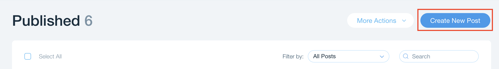
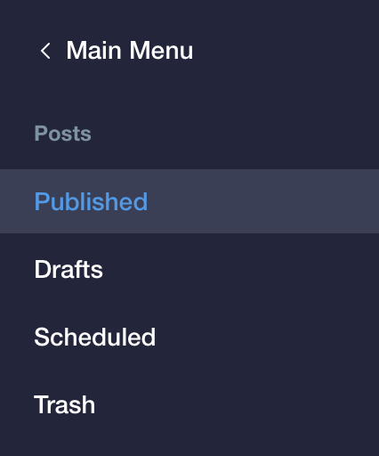
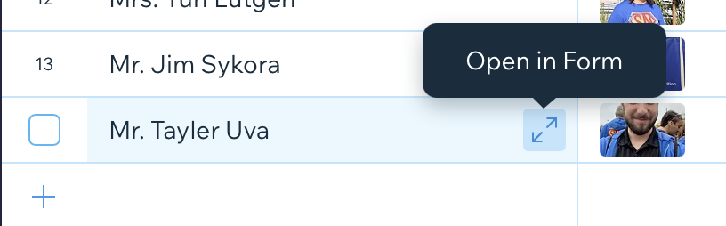

# Website

## Logging In

1. Go to [Wix.com](https://www.wix.com)
2. Click sign-in:  
   
3. Click **Continue with Google**  
4. Sign in with your school provided email address (last###@euhsd.org)
   1. This will redirect you to a Microsoft login screen, use you the same email address.
   2. You will then be redirected AGAIN to the EUHSD login page where you will put your email address and password.
5. Once logged find **SuperNURDs 2020** and select **Select & Edit Site**  
   

!!! Note
 If your login did not work, please contact Tayler about adding you to the list of approved users.

## Updating the Blog

1. [Login](./Logging%20In.md)
2. Select **Blog** from the sidebar:  
   

### Creating New Posts

1. Select **Create New Post**:  
   
2. In the side bar select **Categories** and choose the correct category for the type of post:  
   
3. Write your post title
4. Write your post contents
5. Attached a video and/or photo to the post.
6. Click **Publish** or the arrow next to publish to **Schedule the post**:  
   

### Editing Existing Posts or Draft

1. Select the post type you would like to edit from the side bar:
   
2. Click on the **post title** or the **edit** button:  
   
3. Continue to [create the post](#creating-new-posts)

## Updating Dynamic Pages

1. [Login](./Logging%20In.md)
2. Select **Content Manager** from the sidebar:  
   

### Yearly updates

1. New Season needs to be added to the **Past Seasons** collection.
2. Active mentors (**Mentor** Collection) need to have new tag added for the new season year (**Years Mentored** Column).
3. Active students (**Student** Collection) need to have new tag added for the new season year (**Years Active** Column).
4. New students need to be added (**Student** Collection).
5. Graduated students (**Student** Collection) need to have
   1. College added **College** Column)
   2. Majors added (**Major** Column)
   3. New tag added for graduation date (**Graduation Year** Column)
6. Update the "#### Season" link to the new year
   1. Rename to new year
   2. Change link to new year item

### Editing a Collection

1. Select a collection:  
   

#### Adding a new item

1. Click **+ New Item** (form mode) or scroll to the bottom and click **+** (spreadsheet mode):  
     
   or  
   
2. Fill in the the fields for the new item.

#### Editing an item

You can either edit the item in [spreadsheet mode](#spreadsheet-mode) or [form mode](#form-mode):

##### Spreadsheet Mode

1. Select the cell of the desired item.
2. Change the cell contents.

##### Form Mode

1. Click the expand icon (hover over the first column in a row to make it appear)

2. Change the desired fields in the form
