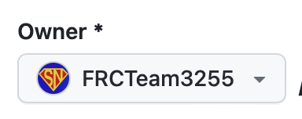
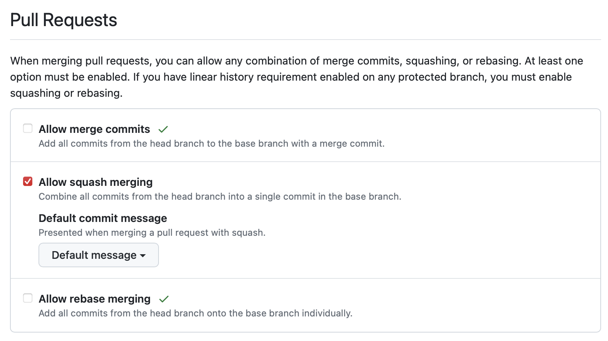
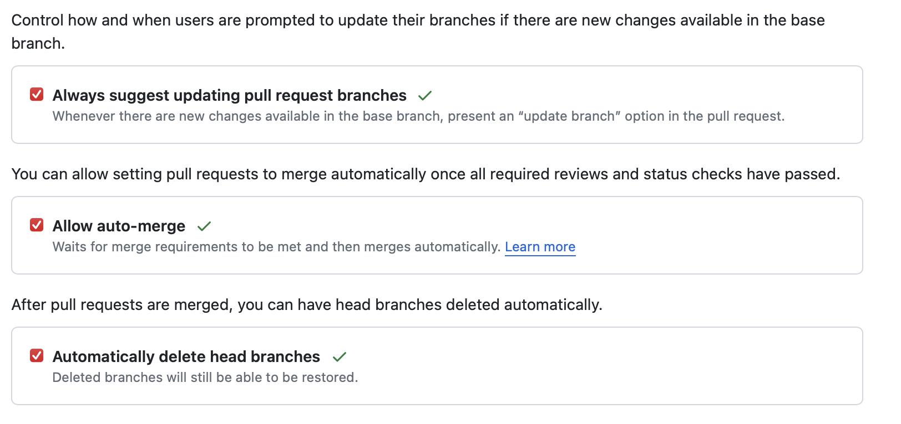
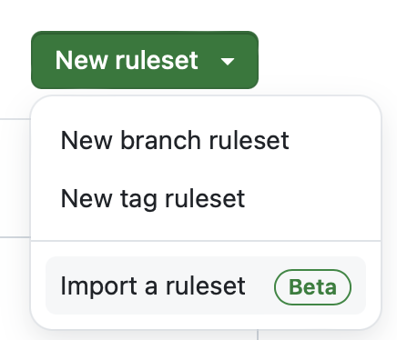

1. Go to [New Repository - Standard Swerve Template](https://github.com/organizations/FRCTeam3255/repositories/new?template_name=Standard_Swerve_Code&template_owner=FRCTeam3255)
2. Make sure **Owner** is set to FRCTeam3255
   
3. Set **Repository name** to the format: `YYYY_Robot_Code` or `YYYY_Offbot_Code` for example `2024_Robot_Code` or `2024_Offbot_Code`
4. Clone the Repo
5. set merge type restriction
   - Uncheck all but **Allow squash merging**
   - 

6. Set the following settings to be checked off
   - 

7. Go to Rules/Rulesets
   1. Select New Rulesets -> Import a ruleset
   2. 
   3. Download [protect_main.json](https://raw.githubusercontent.com/FRCTeam3255/Wiki/main/.downloads/rulesets/protect_main.json){:download}

8. Collaborators and teams
   1. Click Add Teams
   2. Add `Everyone` Team as `Read`
   3. Add `Software Team` as `Write`
   4. Remove yourself
   
