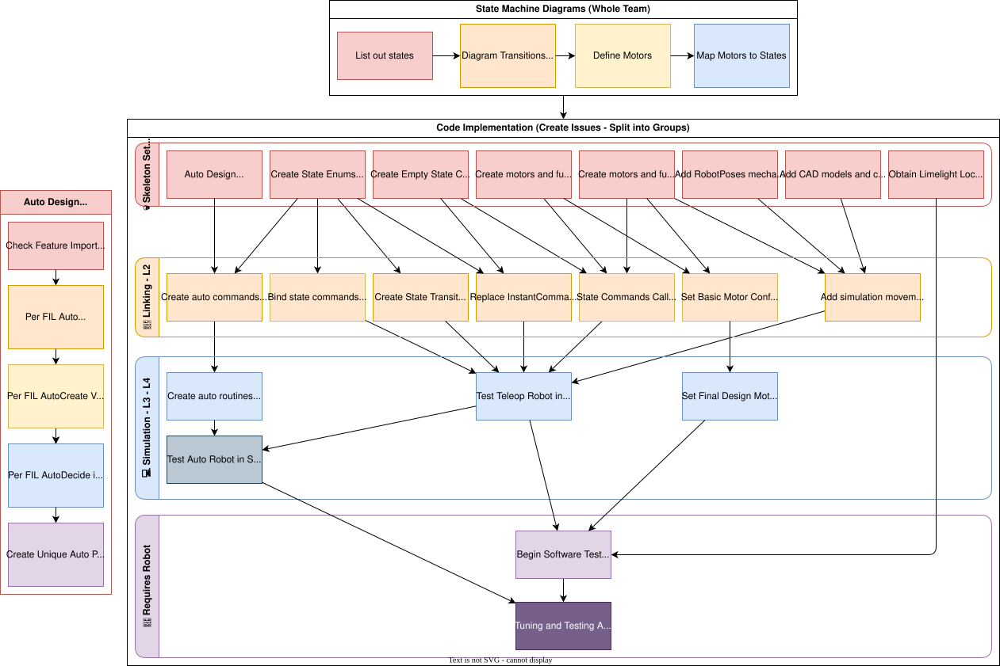

# Programming Order and Test Plan

## Programming Order

---

## Test Plan

### Before Robot Exists

1. Final State Machine Test in Sim (Full functional in Sim)
2. Check CAD for Tooth Counts
3. Obtain Limelight Locations

### After Robot Exists

1. Check Real Robot for Tooth Counts
2. Continuity Test
3. Power On Robot
4. Deploy Code to Robot
5. Set CAN IDs, Motor Names, Firmware
6. Do Swoffsets
7. Verify Tooth Count Mechanism Accuracy by manual movement
8. Check mechanical backlash (slop)
9. Get Soft limits for motors
10. Test for motor directions
11. PID Constants Tuning (Motion Magic)
12. Test FreeSpin motors Current Draw and get baseline via Phoenix
    - Log in Spreadsheet
13. Full Functional
14. Tune Limelight
15. [Tune Interpolation Tables](<Tuning Interpolation Tables.md>)
16. Tune Presets (use interpolation table results)
17. Play Match
    - No Auto
    - Only Automated Aim
    - Record and Discuss
18. Discuss with driveteam and ask what they need
19. Play Match
     - No Auto
     - Only Manual Aim
     - Record and Discuss
20. Test and Tune Auto
21. Durability Testing
    - Lots of Matches w/ Auto
    - Film Every Match
22. Win
