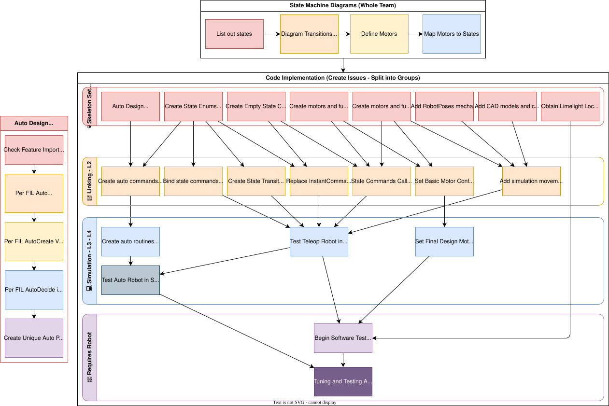

# Programming Order and Test Plan

## Programming Order

---

## Test Plan

### Before Robot Exists (can be done in parallel)

1. Final State Machine Test in Sim (Full functional in Sim)
2. Check CAD for Tooth Counts
3. Obtain Limelight Locations
4. Bring driver station outside
    - Open VSCode
    - Open robot project
    - Open AdvantageScope
    - In Github, pull from main and switch to branch you want to test (usually main)
5. Get controllers
6. Get extension cable
7. Configure field radio to the robot's radio
    - Follow this [radio config page](https://frcteam3255.github.io/Wiki/Software/Configuring%20the%20Radio/) to make it a field radio
8. Bring game pieces outside
9. Remove tarp from the field

### After Robot Exists

1. Check Real Robot for Tooth Counts
2. Continuity Test
3. Power On Robot
4. Deploy Code to Robot
5. Set CAN IDs and motor names; check CAN device firmware and update it if needed
6. Redeploy code if CAN IDs or firmware were changed
7. Do Swoffsets
8. Verify Tooth Count Mechanism Accuracy by manual movement
9. Check mechanical backlash (slop)
10. Get Soft limits for motors
11. Test for motor directions
12. PID Constants Tuning (Motion Magic)
13. Test FreeSpin motors Current Draw and get baseline via Phoenix
    - Log in Spreadsheet
14. Full Functional
15. Tune Limelight
16. [Tune Interpolation Tables](<Tuning Interpolation Tables.md>)
17. Tune Presets (use interpolation table results)
18. Play Match
    - No Auto
    - Only Automated Aim
    - Record and Discuss
19. Discuss with driveteam and ask what they need
20. Play Match
     - No Auto
     - Only Manual Aim
     - Record and Discuss
21. Test and Tune Auto
22. Durability Testing
    - Lots of Matches w/ Auto
    - Film Every Match
23. Win
