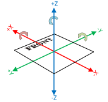

# Setting Up RobotPoses for AdvantageScope Simulation

Use this guide to make your subsystem `RobotPose` components move correctly in AdvantageScope simulation.

## In SolidWorks
Measure each component pivot point relative to the SolidWorks origin and record those values.

If your SolidWorks origin is **not** at the robot front-center, also measure the origin offset from the robot front-center so you can convert values before entering them in code.

!!! tip
    Be consistent about what you call the robot front before taking any measurements.

## In Code
Record each pivot measurement relative to the **front of the robot** in this order:

1. `x` = forward/back
2. `y` = left/right
3. `z` = up/down

If you measured from a different CAD origin, convert to front-relative values first using your measured origin offset.

!!! warning
    If a value looks flipped in simulation, verify sign (`+` vs `-`) before changing anything else.

## In AdvantageScope
1. Add each pivot point as a cone in your 3D view.
2. Compare cone locations to your expected mechanism pivot points.
3. If cones are incorrect, check:
    - measurement correctness,
    - coordinate order (`x`, `y`, `z`),
    - sign (positive vs negative).
4. Correct one axis at a time:
    - If the cone is mirrored front/back, flip the sign of `x`.
    - If the cone is mirrored left/right, flip the sign of `y`.
    - If the cone is mirrored up/down, flip the sign of `z`.
    - If the cone moves in a completely wrong direction, verify the axis order is still `x`, then `y`, then `z`.

If the cone locations are wrong, the mechanism will not move correctly in simulation. Do not continue until cone placement looks correct.
