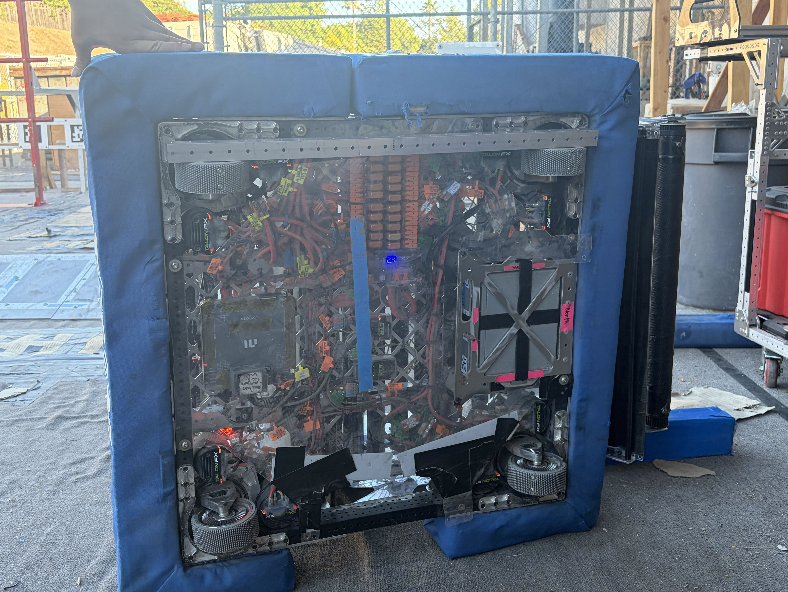
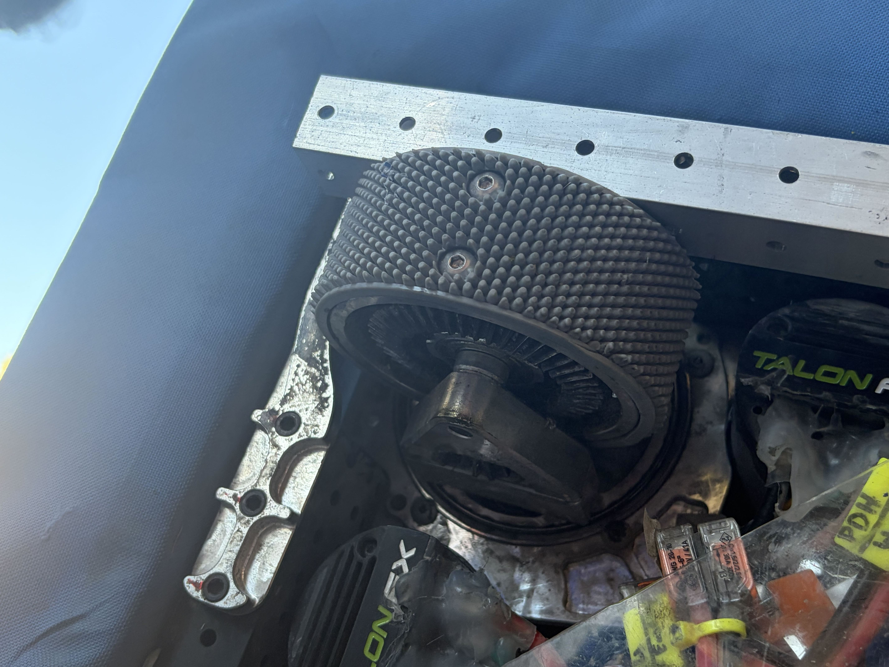
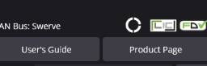
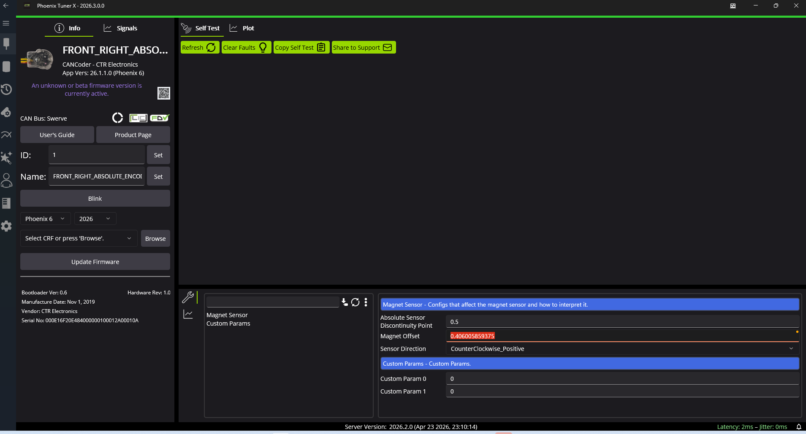
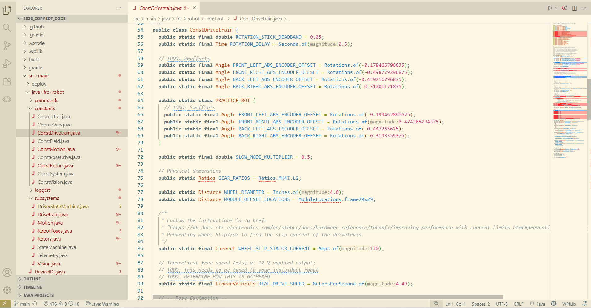

# Swoffsets (Swerve Offsets)

## Resources you must gather
- A straight-edge, slightly longer than the distance between modules (A 1 inch tube works fine for this)
- A Laptop with the following Software installed:
    - Code for your robot
    - FRC Driver Station
    - Phoenix Tuner
- A Controller

---
## Set the Front of the Robot (If not already done)
If this hasn't been done already, you need to determine where the *front* of the robot will be and name the modules accordingly.
The front of the robot is typically the side that the scoring mechanism is on, but it can be any side. Having it be the scoring mechanism side makes it easy to remember. 

Whichever side you choose, you need to keep it consistent across *both robots (comp & practice), the AdvantageScope models, and PathPlanner.* You'll need to communicate which side is the front to the rest of the team.

### Steps
1. Pick a side to be the front!
2. Take Gaff tape and *physically label* the front of the robot so that it's visible from the underside
3. Also label the **robot's** left & right. This saves lots of headaches later. 
> If you're looking at the underside, this may not match *your* left and right, since they're relative to where the robot's left is when it's on the ground. This depends on how the robot is tipped over. Reference the [WPILib Robot coordinate system](https://docs.limelightvision.io/docs/docs-limelight/getting-started/FRC/networking#set-ip-address); The robot's left is positive on the y axis. 
4. Put small labels near each module to indicate if they're `Front Left (0), Front Right (1), Back Left (2), or Back Right (3)`. 
5. Using Phoenix Tuner, set the CAN id's & names of all Motors & CANCoders to match their physical location. Make sure their ids match the ones in your codebase's `RobotMap.java`.

---
## Getting the Swoffsets
1. Power on the robot
2. Deploy your current code to the robot if you haven't already
3. Identify the *front right and back right* swerve modules
4. Rotate *all* Bevels to face the robot's **middle**
    - Bevels are the spiky lookin gear things on the side of the wheel.
    - 
5.  press your straightedge into the top part of the wheels to ensure that the modules are straight.
    - 
6. Connect to the robot, then open phoenix tuner
7. Navigate to the coorisponding encoder for the motor you are tuning
8. Press zero the encoder(the little smash bros ball looking icon at the upper left)

9. then press refresh then copy the magenet offsets

10. paste the value into the code in const drivetrain offsets(not the practice bot offsets)

11.Repeat for the rest of the motors
---

## Verifying your Swoffsets
1. Redeploy code to the robot, now with the correct offsets
2. Open Driverstation, connect a controller, reset your pose to be relative to you, then begin driving while it is on it's side to see if the wheels go the right way
3. if looks good then put in on the ground and drive it a bit, and if nothing goes wrong, you've done swoffsets correctly! 🎉

## Common Failures:
- **Wheel(s) go in "random" directions.**
    - You may have mapped the wrong offsets to the wrong modules. Check that your *front left* module in code is mapped to the module on the robot's front left. Check that the offset you got from that module in glass was set to the same module in code. Repeat for all the modules.
    - Another possible issue is a hardware issue with the CANCoder. Ensure that the magnet was glued when installing the module. An un-glued magnet will cause your module to slowly drift.
- **Robot doesn't drive in the correct direction, but all of the wheels face the same way.**
*Example: Moving up on the stick makes the robot go backwards*
    - You've likely done swoffsets incorrectly or mapped the modules incorrectly. Check that your *front left* module in code is mapped to the module on the robot's front left. Repeat for all of your modules. Then, redo your swoffsets and make sure you orient the wheels in the correct direction!
-**Robot starts driving correctly on boot, but wheel(s) excessively drift over time.**
    - Reboot the robot. If the robot begins driving correctly again on boot, this eliminates the CANCoder as the issue. If not, ensure that the magnet was glued when installing the module.
    - Otherwise, there is likely something mechanically wrong with the module. This is typically an issue with the bearing or the belt. 