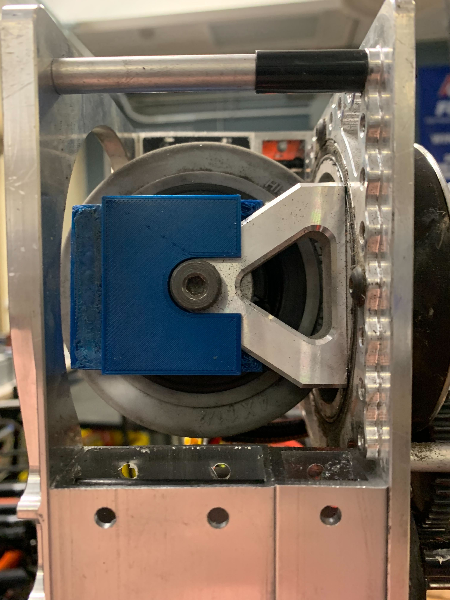

# Swoffsets (Swerve Offsets)

## Resources you must gather
- A straight-edge, slightly longer than the distance between modules (A 1 inch tube works fine for this)
- 2 Swoffset Bricks (3d printed, found in the Electrical Cabinet's "Other Tools" Drawer)
- A Laptop with the following Software installed:
    - Glass
    - Code for your robot
    - FRC Driver Station
    - AdvantageScope
    - Phoenix Tuner
- A Controller
- Gaff Tape & A Sharpie

---
## Set the Front of the Robot (If not already done)
If this hasn't been done already, you need to determine where the *front* of the robot will be and name the modules accordingly.
The front of the robot is typically the side that the scoring mechanism is on, but it can be any side. Having it be the scoring mechanism side makes it easy to remember. 

Whichever side you choose, you need to keep it consistent across *both robots (comp & practice), the AdvantageScope models, and PathPlanner.* You'll need to communicate which side is the front to the rest of the team.

### Steps
1. Pick a side to be the front!
2. Take Gaff tape and *physically label* the front of the robot so that it's visible from the underside
3. Also label the **robot's** left & right. This saves lots of headaches later. 
> If you're looking at the underside, this will be the OPPOSITE of *your* left and right, since they're relative to where the robot's left is when it's on the ground. Reference the [WPILib Robot coordinate system](https://docs.limelightvision.io/docs/docs-limelight/getting-started/FRC/networking#set-ip-address); The robot's left is positive on the y axis. 
4. Put small labels near each module to indicate if they're `Front Left (0), Front Right (1), Back Left (2), or Back Right (3)`. 
5. Using Phoenix Tuner, set the CAN id's & names of all Motors & CANCoders to match their physical location. Make sure their ids match the ones in your codebase's `RobotMap.java`.

---
## Getting the Swoffsets
1. Power on the robot
2. Deploy your current code to the robot if you haven't already
3. Identify the *front right and back right* swerve modules
4. Rotate *both* Bevels to face the robot's **right**
    - Bevels are the spiky lookin gear things on the side of the wheel. They're on the opposite side of where you're going to put the swoffset block
5. Insert the Swoffset blocks into those modules, pressing it in until it matches the image below. Then, press your straightedge into the flat part of the blocks to ensure that the modules are straight.
    - 
    - 
6. Connect to the robot, then open Glass
7. Navigate to the dropdown that shows the Absolute (Raw) Encoder values for your modules
    - Front Left = 0, Front Right = 1, Back Left = 2, Back Right = 3
    - 
8. Copy the Absolute Encoder Raw value for that module and paste it into the offset constant in your code
9. Once you've done both modules, repeat steps 3-8 with the *front left and back left* modules
10. Take the blocks out before you begin driving the swerve

---
## Verifying your Swoffsets
1. Redeploy code to the robot, now with the correct offsets
2. Open AdvantageScope and navigate to the `Swerve` tab
3. Drag over the `Desired States` and `Actual States` to `Sources` on the bottom of the window 
4. Open Driverstation, connect a controller, and begin driving
5. If pressing up on the joystick makes the robot drive forwards, you've done swoffsets correctly! 🎉
6. Verify that the `Desired States` mostly match the `Actual States` using the AdvantageScope UI. Revel in how cool they look. Then go get some fruit snacks because you've earned it 😎
_HAoyjhRLd6.png)
