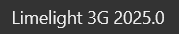
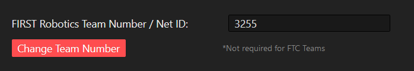
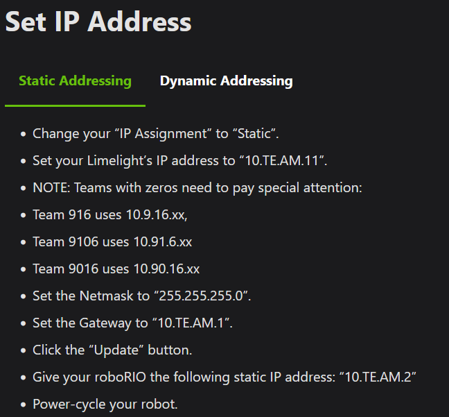
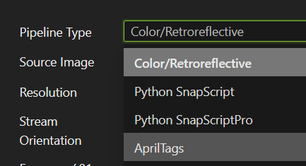
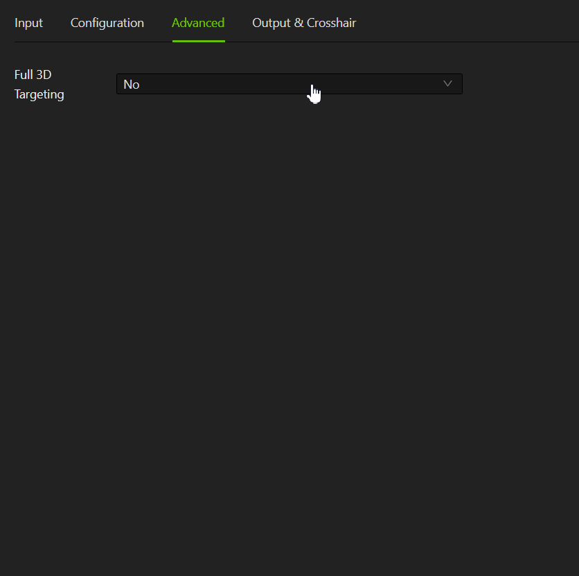

# Updating Limelight Firmware

## Prerequisites
- Laptop with Balena Etcher installed
- USB Type C Cable

## Initial Setup

0. **Capture existing limelight postions (screen shot and writen in code)**
    - they will be deleted after flashing so it is crucial to capture them

1. Download Required Files
    - Visit the [Limelight Downloads Page](https://limelightvision.io/pages/downloads)
    - Download Limelight OS
    - Download AprilTag Map

2. Prepare Limelight Connection
    - Power off the robot
    - Hold down the red button on Limelight
    - Connect USB Type C cable to laptop (while holding down red button)

3. Flash Firmware
    - Launch [Balena Etcher](https://etcher.balena.io/) as administrator
    - **Important:** Do NOT format when prompted
    - Select "Flash from file" and choose Limelight OS
    - Choose Limelight as target device
    - Click "Flash" and wait for completion

4. Initial Configuration
    - Disconnect Limelight from your laptop
    - Power on robot
    - Connect to robot WiFi
    - Access `limelight.local:5801` in browser
    - Verify firmware version (top-right corner)
    - 

5. Network Configuration
    - Navigate to Settings tab
    - Update team number to 3255
    - 
    - Configure IP address settings
    

6. Final Steps
    - Power cycle robot
    - Reconnect to robot
    - Access the limelight in browser at `10.32.55.11:5801`

## AprilTag Configuration

1. Pipeline Setup
    - Switch to Pipelines tab
    - Set pipeline type to AprilTags:
    - 
    - Enable full 3D targeting
    

2. Field Configuration
    - Configure MegaTag Field-Space Localization
    - Set robot constants (based on [WPILib Robot coordinate system](https://docs.wpilib.org/en/stable/docs/software/basic-programming/coordinate-system.html#wpilib-coordinate-system))
    - Upload field map file

3. Finalization
    - Your limelight is now ready to tune at competition!
    - Adjust input settings as needed, depending on light settings, lens focus, ect. 